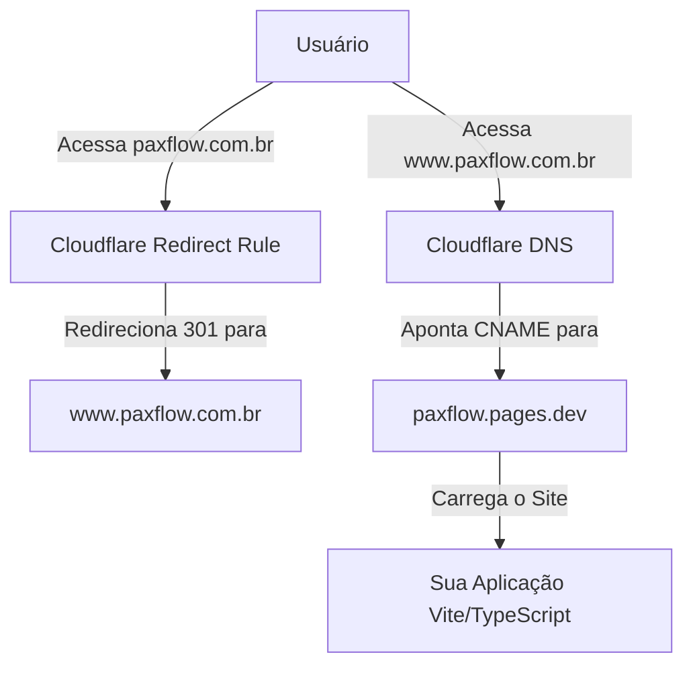

# Configuração de Domínio Personalizado: www.paxflow.com.br no Cloudflare Pages

Este guia prático descreve o passo a passo completo para associar seu domínio comprado no **Registro.br** (`paxflow.com.br`) ao seu projeto no **Cloudflare Pages** (`paxflow.pages.dev`), configurando o subdomínio `www` como principal e estabelecendo um redirecionamento automático e amigável para SEO a partir do domínio raiz (apex).

---

## 📋 Visão Geral da Arquitetura DNS Recomendada



---

## 🛠️ Passo 1: Adicionar o Domínio na Cloudflare

Para que a Cloudflare gerencie seu DNS com alta velocidade e emita certificados SSL gratuitos de forma automática, precisamos adicioná-lo à plataforma:

1. Acesse o [Painel da Cloudflare](https://dash.cloudflare.com/) e faça login (ou crie uma conta gratuita).
2. Na página inicial do painel, clique em **Add a Site** (Adicionar um site) ou **Add Area** no canto superior direito.
3. Insira o seu domínio completo sem subdomínio: **`paxflow.com.br`** e clique em **Continue**.
4. Na tela de seleção de planos, role até o final da página e selecione o plano **Free** (Gratuito - R$ 0). Clique em **Continue**.
5. A Cloudflare fará uma varredura automática nos registros DNS existentes do seu domínio. Como ele é recém-comprado e não possui outros serviços ativos, você pode clicar em **Continue** no final da lista.
6. A Cloudflare exibirá os **Nameservers da Cloudflare** que você deve configurar no Registro.br. Eles serão parecidos com estes:
   * **`danny.ns.cloudflare.com`**
   * **`leo.ns.cloudflare.com`**
   
   > [!IMPORTANT]
   > Copie exatamente os dois nomes de servidores fornecidos na sua tela antes de prosseguir para o próximo passo.

---

## 🌐 Passo 2: Alterar os Servidores de DNS no Registro.br

Agora vamos delegar a autoridade de DNS do Registro.br para a Cloudflare.

1. Acesse o site do [Registro.br](https://registro.br/) e faça login.
2. No painel principal, clique em cima do seu domínio **`paxflow.com.br`**.
3. Role a página até encontrar a seção **DNS** e clique no botão **Alterar Servidores DNS**.
4. Insira os servidores fornecidos pela Cloudflare:
   * No campo **Servidor 1**, cole o primeiro nameserver (ex: `danny.ns.cloudflare.com`).
   * No campo **Servidor 2**, cole o segundo nameserver (ex: `leo.ns.cloudflare.com`).
   * *Caso haja campos adicionais de Servidor 3 ou 4 em branco, pode deixá-los vazios.*
5. Clique em **Salvar Alterações**.

> [!NOTE]
> A propagação de DNS (o tempo que leva para o Registro.br informar à internet que agora a Cloudflare cuida do seu domínio) costuma demorar **de 10 minutos a 2 horas**, embora o Registro.br dê um prazo formal de até 24 horas. Você receberá um e-mail da Cloudflare confirmando quando o domínio estiver ativo.

---

## ⚡ Passo 3: Configurar os Domínios no Cloudflare Pages

Com o domínio registrado na Cloudflare, vamos dizer ao Cloudflare Pages para responder por ele.

1. No painel da Cloudflare, clique em **Workers & Pages** no menu lateral esquerdo.
2. Clique no seu projeto do Pages (provavelmente chamado `paxflow`).
3. Selecione a aba **Custom domains** (Domínios personalizados).
4. Clique em **Set up a custom domain** (Configurar um domínio personalizado).
5. Digite seu domínio principal: **`www.paxflow.com.br`** e clique em **Continue**.
6. A Cloudflare reconhecerá que o domínio está na sua conta e oferecerá a criação automática do registro DNS. Clique em **Activate domain** (Ativar domínio).
   * *A Cloudflare criará um registro do tipo `CNAME` apontando de `www` para `paxflow.pages.dev`.*
7. Agora, repita o processo para garantir que a rota sem o `www` também seja processada pelo Pages:
   * Clique novamente em **Set up a custom domain**.
   * Digite **`paxflow.com.br`** (sem o www) e clique em **Continue**.
   * Clique em **Activate domain** (Ativar domínio).
   * *A Cloudflare criará um registro de DNS especial do tipo `CNAME` (com flattening de domínio apex) para apontar o domínio raiz diretamente para `paxflow.pages.dev`.*

---

## 🔀 Passo 4: Criar Regra de Redirecionamento (paxflow.com.br -> www.paxflow.com.br)

Para evitar problemas de SEO (conteúdo duplicado indexado no Google) e manter o padrão estético com o `www`, vamos criar uma regra para redirecionar permanentemente (HTTP 301) o domínio raiz para o subdomínio principal.

1. No painel da Cloudflare, volte à página inicial e selecione o site **`paxflow.com.br`** na sua lista.
2. No menu lateral esquerdo, vá em **Rules** (Regras) > **Redirect Rules** (Regras de Redirecionamento).
3. Clique no botão **Create rule** (Criar regra).
4. Preencha a regra com as seguintes configurações:
   * **Rule name (Nome da regra):** `Redirect Apex to WWW`
   * **When incoming requests match (Quando as solicitações corresponderem):** 
     * Selecione **Custom filter expression** (Expressão de filtro personalizada).
     * **Field (Campo):** `Hostname`
     * **Operator (Operador):** `equals`
     * **Value (Valor):** `paxflow.com.br`
   * **Then (Então...):**
     * **URL redirect: Type (Tipo):** Selecione **Dynamic** (Dinâmico).
     * **Expression (Expressão):**
       ```text
       concat("https://www.paxflow.com.br", http.request.uri.path)
       ```
       *(Esta expressão garante que se alguém digitar `paxflow.com.br/todo`, será perfeitamente redirecionado para `www.paxflow.com.br/todo`)*
     * **Status code (Código de status):** Selecione **301** (Moved Permanently / Redirecionamento Permanente).
     * **Preserve query string (Preservar string de consulta):** Deixe a caixinha **Marcada** ✅.
5. Clique em **Deploy** (Implantar) no final da página.

---

## ✅ Passo 5: Verificação e Teste

Assim que a propagação terminar (você pode verificar o status na aba **Custom domains** do seu projeto Pages), faça os seguintes testes no seu navegador:

1. Acesse **`https://www.paxflow.com.br`**:
   * O site deve carregar perfeitamente.
   * O cadeado verde de SSL deve estar visível e ativo.
2. Acesse **`https://paxflow.com.br`** (sem o www):
   * O navegador deve imediatamente mudar a URL para **`https://www.paxflow.com.br`** e carregar o site.
3. Acesse **`https://paxflow.com.br/todo`**:
   * O navegador deve redirecionar corretamente para **`https://www.paxflow.com.br/todo`** e mostrar sua lista de tarefas/página correspondente.

---

### 💡 Dicas Extras de Performance & Segurança

* **Always Use HTTPS:** Vá em **SSL/TLS** > **Edge Certificates** no painel do seu domínio na Cloudflare e marque a opção **Always Use HTTPS** (Sempre usar HTTPS) como ativada.
* **Auto Minify:** Na aba **Speed** > **Optimization**, você pode ativar o Auto Minify para HTML, CSS e JavaScript para reduzir ainda mais o tempo de carregamento da sua aplicação Vite!
