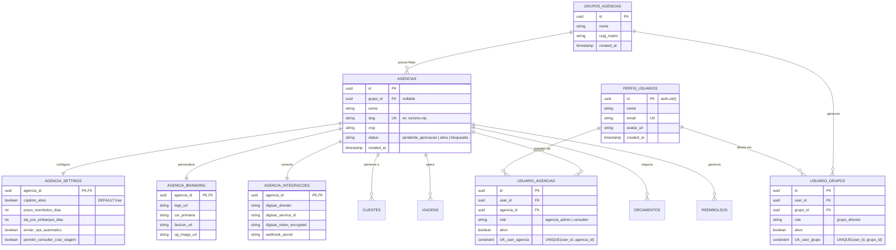
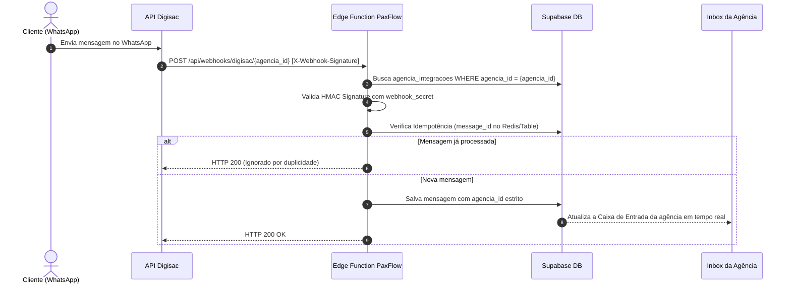
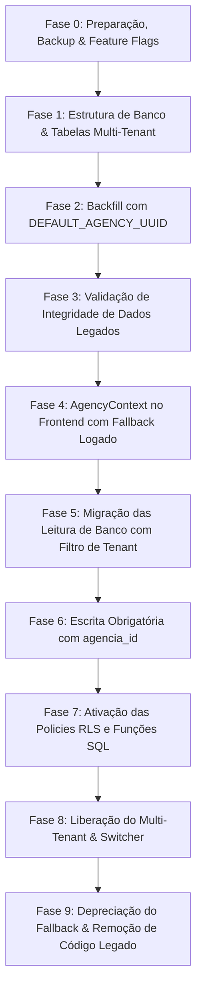

# Especificação Arquitetural Enterprise: Escalonamento Multi-Tenant & Grupos de Agências (PaxFlow)

> [!IMPORTANT]
> **Status:** Documentação Técnica Salva para Implementação Futura (Revisão Cirúrgica v2.1).
> **Princípio de Segurança Primário:** A `agencia_id` é a unidade primária e obrigatória de isolamento operacional e de regras de negócio. A ausência de contexto de agência em ambiente multi-tenant é tratada como **Erro de Aplicação**, nunca como fallback silencioso definitivo.

---

## 1. Princípios Arquiteturais Fundamentais

1. **Agência como Tenant Operacional**: Toda entidade operacional (`clientes`, `viagens`, `orcamentos`, `reembolsos`, `escala`) pertence a **exatamente uma agência** (`agencia_id NOT NULL`).
2. **Grupo como Camada de Agregação e Autorização**: O `grupo_id` é uma camada de consolidação. A associação ao grupo é derivada da relação `agencia -> grupo`, evitando redundância e anomalias de dados (ex: viagem com `agencia_id = A` e `grupo_id = B`).
3. **Defesa em Profundidade (Defense in Depth)**:
   - *Frontend*: Interface reativa ao contexto ativo (`AgencyContext`).
   - *Backend*: Serviços validam autorização do usuário, escopo do tenant e estado da *feature flag* em todas as rotas.
   - *Banco de Dados*: Funções centralizadas de RLS + Constraints `NOT NULL` e `FOREIGN KEY`.
4. **Governança do Co-piloto de IA por Tenant**: O recurso de Co-piloto é controlado granularmente por agência (`copiloto_ativo` em `agencia_settings`). Se desativado, os atalhos, modais e chamadas de IA daquela agência são totalmente bloqueados no frontend e rejeitados no backend.
5. **Fallback Transitório com Telemetria**: A agência padrão (`DEFAULT_AGENCY_UUID`) é utilizada exclusivamente durante a fase de migração de dados legados, registrando logs de auditoria. No estado final, requisições sem `agencia_id` disparam erro imediato.
6. **Segurança de Segredos**: Credenciais de integrações (Digisac, IA, Google Drive) nunca são expostas ao frontend ou trafegadas em query parameters de URLs.

---

## 2. Matriz Consolidada de Decisões Arquiteturais

| Pilar Arquitetural | Decisão Selecionada | Descrição Técnica |
| :--- | :--- | :--- |
| **Modelo Organizacional** | **Hierárquico Dedicado** | Tabela `grupos_agencias` (Rede/Holding) e tabela `agencias` (Filiais). Agências únicas possuem `grupo_id = NULL`. |
| **Fonte Única de Verdade** | **`agencia_id` Obrigatório** | Tabelas operacionais contêm estritamente `agencia_id NOT NULL`. O grupo é resolvido via JOIN com `agencias.grupo_id`. |
| **Modelagem de Tabelas** | **Tabelas de Configuração Desacopladas** | Divisão em `agencias`, `agencia_settings`, `agencia_branding` e `agencia_integracoes` (evitando mega-tabelas). |
| **Governança do Co-piloto (IA)** | **Feature Flag por Agência** | Campo `copiloto_ativo BOOLEAN DEFAULT true` em `agencia_settings`. Controla visibilidade UI e bloqueia requisições backend/Edge Functions por agência. |
| **Identidade e Autorização** | **Modelos de Membership Separados** | `usuario_agencias` (papéis: `agencia_admin`, `consultor`) e `usuario_grupos` (papel: `grupo_director`). `super_admin` possui escopo global. |
| **Contexto da Aplicação** | **`AgencyContext` Reativo Centralizado** | O objeto de contexto gerencia `activeAgencyId`, `availableAgencies`, `role`, `permissions` e `copilotoAtivo`. O Tenant Switcher altera o contexto ativo sem ignorar autorizações no backend. |
| **Branding & Open Graph** | **Customização por Agência com Slug** | Cada agência possui `slug` único, `logo_url`, `cor_primaria`, `favicon_url` e Meta Tags Open Graph dinâmicas. |
| **Segurança em Links Públicos** | **Tokens Criptográficos (UUIDv4)** | `public_access_token UUID NOT NULL UNIQUE DEFAULT gen_random_uuid()`. O backend valida token $\rightarrow$ viagem $\rightarrow$ agência $\rightarrow$ permissão pública. |
| **Integração WhatsApp Digisac** | **Webhook REST com Assinatura em Header** | `POST /api/webhooks/digisac/{agencia_id}` com validação de assinatura `X-Webhook-Signature` no header e controle de idempotência. |
| **Armazenamento de Arquivos** | **Storage Estruturado com ID Único** | `/agencias/{agencia_id}/clientes/{cliente_id}/{document_id}/{filename}` no Supabase Storage com RLS por pasta de agência. |
| **Funções RLS Centralizadas** | **Helper Functions SQL** | Policies de RLS reutilizam `user_is_super_admin()`, `user_can_access_agency()` e `user_can_access_group()`. |
| **Rollout da Migração** | **Implantação em 9 Ondas com Rollback** | Rollout incremental com feature flags, validação de integridade, testes de isolamento negativo e plano de desativação/rollback. |

---

## 3. Modelo de Dados Relacional (Esquema SQL/Supabase)



---

## 4. Governança & Segurança do Módulo Co-piloto (IA)

> [!CAUTION]
> **Risco de Vazamento de Cota de API & Uso Indevido:**
> Caso uma agência desative o Co-piloto de IA nas configurações globais (`copiloto_ativo = false`), a desativação **deve ocorrer no Frontend e no Backend simultaneamente**.

### Fluxo de Validação de Segurança do Co-piloto
1. **Frontend (App Shell & Routers)**:
   - O objeto `AgencyContext` lê `copiloto_ativo` da agência selecionada.
   - Se `copiloto_ativo === false`, oculta botões, ícones, modais e atalhos de teclado referentes ao Co-piloto.
2. **Backend / Edge Functions**:
   - Cada chamada de inferência ou automação de IA valida obrigatoriamente se a agência solicitante possui `copiloto_ativo = true`.
   - Se `copiloto_ativo === false`, a requisição é rejeitada com `HTTP 403 Forbidden` (`{"error": "O recurso Co-piloto está desativado para esta agência."}`).

---

## 5. Políticas RLS com Funções Centralizadas de Autorização

Para evitar duplicidade de código SQL e garantir manutenibilidade em todas as tabelas operacionais, serão criadas três funções SQL de segurança:

```sql
-- 1. Verificar se o usuário é Super Admin PaxFlow
CREATE OR REPLACE FUNCTION user_is_super_admin(p_user_id UUID)
RETURNS BOOLEAN AS $$
BEGIN
  RETURN EXISTS (
    SELECT 1 FROM perfis_usuarios pu
    WHERE pu.id = p_user_id AND pu.is_super_admin = true
  );
END;
$$ LANGUAGE plpgsql SECURITY DEFINER;

-- 2. Verificar se o usuário possui acesso à agência específica
CREATE OR REPLACE FUNCTION user_can_access_agency(p_user_id UUID, p_agencia_id UUID)
RETURNS BOOLEAN AS $$
BEGIN
  -- Acesso direto via agência
  IF EXISTS (
    SELECT 1 FROM usuario_agencias ua
    WHERE ua.user_id = p_user_id AND ua.agencia_id = p_agencia_id AND ua.ativo = true
  ) THEN
    RETURN true;
  END IF;

  -- Acesso via Grupo (se o usuário for Diretor do Grupo ao qual a agência pertence)
  RETURN EXISTS (
    SELECT 1 FROM usuario_grupos ug
    JOIN agencias a ON a.grupo_id = ug.grupo_id
    WHERE ug.user_id = p_user_id AND a.id = p_agencia_id AND ug.ativo = true
  );
END;
$$ LANGUAGE plpgsql SECURITY DEFINER;

-- 3. Exemplo de Policy RLS em tabela operacional (Viagens)
CREATE POLICY "Isolamento de Viagens por Agencia" 
ON viagens 
FOR ALL 
USING (
  user_is_super_admin(auth.uid()) 
  OR user_can_access_agency(auth.uid(), agencia_id)
);
```

---

## 6. Arquitetura de Webhooks Digisac com Idempotência e Segurança



---

## 7. Plano de Migração Incremental em 9 Ondas (Rollout & Rollback)



### Checklist dos Critérios de Conclusão (Definition of Done)

- [ ] 100% das entidades operacionais contêm `agencia_id NOT NULL` válido.
- [ ] 0 registros com anomalias de pertencimento entre agência e grupo.
- [ ] 100% das tabelas críticas protegidas por RLS reutilizando as funções SQL de segurança.
- [ ] **Feature Flag `copiloto_ativo` por Agência**:
  - *Teste*: Agência com `copiloto_ativo = false` tenta acessar atalhos ou chamadas de IA $\rightarrow$ UI oculta e backend retorna `403 Forbidden`.
- [ ] **Testes Negativos de Isolamento Automatizados**:
  - *Teste*: Agência A tenta acessar registros da Agência B via ID direto $\rightarrow$ Resultado esperado: `404 Not Found` / `403 Forbidden`.
- [ ] Diretor de Grupo visualiza relatórios consolidados das agências filiadas.
- [ ] Roteamento de Webhooks Digisac validado via HMAC e idempotência por `message_id`.
- [ ] Links públicos acessíveis exclusivamente via `public_access_token` UUID aleatório.
- [ ] Armazenamento de arquivos no Storage organizado no padrão `/agencias/{agencia_id}/...`.
- [ ] Ocorrências do fallback da agência legada reduzidas a **Zero** no monitoramento de logs.
