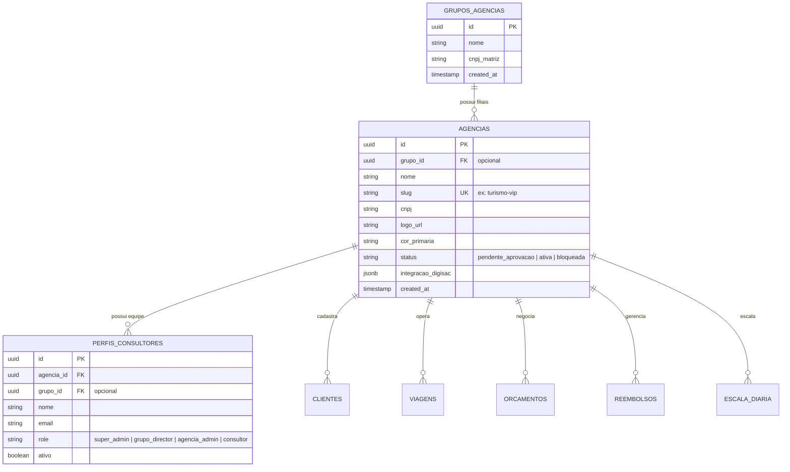
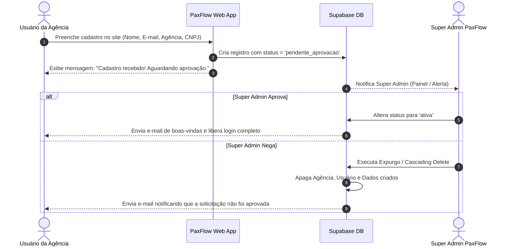

# Plano Arquitetural: Escalonamento Multi-Tenant & Grupos de Agências (PaxFlow)

> [!IMPORTANT]
> **Status:** Documentação Salva para Implementação Futura.
> **Nota de Risco:** A migração para Multi-Tenant exige planejamento cuidadoso de regresso/backward-compatibility para a agência atualmente ativa no sistema.

---

## 1. Resumo da Solução e Viabilidade

O escalonamento do PaxFlow para atender **N agências de turismo** (sejam agências únicas/independentes ou redes/grupos empresariais) é **altamente viável** e segue as melhores práticas de arquitetura SaaS moderna baseada em **PostgreSQL / Supabase Multi-Tenant por Coluna com Row Level Security (RLS)**.

Esta abordagem permite isolamento total entre empresas concorrentes, suporte a consolidação de relatórios para diretorias de redes/holdings e retenção de alta performance sem a complexidade de múltiplos bancos de dados.

---

## 2. Decisões Arquiteturais Definidas no Planejamento

| Pilar Arquitetural | Decisão Selecionada | Descrição Técnica |
| :--- | :--- | :--- |
| **Modelo de Organização** | **Hierárquico Dedicado** | Tabela `grupos_agencias` (Holding/Rede) e tabela `agencias` (Filiais/Lojas). Agências independentes possuem `grupo_id = NULL`. |
| **Isolamento de Dados** | **Isolamento Estrito + Leitura de Grupo** | Cada operação (`clientes`, `viagens`, `orcamentos`, `reembolsos`, `escala`) é atrelada estritamente a um `agencia_id`. O nível Grupo possui visibilidade consolidada para leitura/relatórios. |
| **Hierarquia de Papéis** | **4 Níveis de Acesso** | `super_admin` (Equipe PaxFlow) $\rightarrow$ `grupo_director` (Diretoria da Rede) $\rightarrow$ `agencia_admin` (Gerente da Loja) $\rightarrow$ `consultor` (Operacional). |
| **Branding & Links Públicos** | **Customização por Agência com Slug** | Cada agência possui `slug`, `logo_url`, `cor_primaria` e credenciais WhatsApp Digisac. Links públicos (Itinerário VIP e NPS) carregam a marca da agência correspondente via `slug`. |
| **Armazenamento de Arquivos** | **Storage Gerenciado PaxFlow** | Todos os documentos são mantidos no Supabase Storage do PaxFlow sob a estrutura de pastas `/{grupo_id}/{agencia_id}/{cliente_id}/filename.pdf`, protegidos por RLS no Storage. |
| **Segurança no Banco** | **Supabase RLS por Colunas** | Adição de `agencia_id` e `grupo_id` em todas as tabelas operacionais com políticas RLS automáticas ativadas no banco. |
| **Onboarding & Anti-Spam** | **Auto-Cadastro com Moderação** | O auto-cadastro cria a agência com status `'pendente_aprovacao'`. O `super_admin` pode **Aprovar** (libera acesso completo) ou **Negar** (executa expurgo/purge automático apagando todos os dados criados). |
| **Limites de Plano** | **Sem Limites (Fase Beta)** | Sem bloqueios de plano ou cotas de usuários na fase inicial do rollout Multi-Tenant. |

---

## 3. Modelo de Dados Proposto (Esquema SQL/Supabase)



### Novas Tabelas a Criar

1. **`grupos_agencias`**:
   - `id` (UUID, Primary Key)
   - `nome` (Text)
   - `cnpj_matriz` (Text, Opcional)
   - `created_at` (Timestamp)

2. **`agencias`**:
   - `id` (UUID, Primary Key)
   - `grupo_id` (UUID, Foreign Key $\rightarrow$ `grupos_agencias.id`, Nullable)
   - `nome` (Text)
   - `slug` (Text, Unique, Ex: `"viagens-exemplo"`)
   - `cnpj` (Text)
   - `logo_url` (Text)
   - `cor_primaria` (Text)
   - `status` (Text: `'pendente_aprovacao'`, `'ativa'`, `'recusada'`, `'bloqueada'`)
   - `digisac_domain`, `digisac_token`, `digisac_service_id` (Text)
   - `created_at` (Timestamp)

### Alterações em Tabelas Existentes

Adição da coluna `agencia_id` (UUID REFERENCES `agencias(id)`) e `grupo_id` (Nullable) em:
- `perfis_consultores`
- `global_settings` (convertida em `agencia_settings`)
- `clientes`
- `viagens`
- `produtos_viagem`
- `orcamentos`
- `reembolsos`
- `escala_diaria`
- `solicitacoes_escala`
- `banco_folgas`
- `meta_periodos`
- `mensagens_diretas`

---

## 4. Políticas de Segurança (Row Level Security - RLS)

As políticas de segurança no Supabase serão configuradas para extrair o `agencia_id` e `grupo_id` diretamente do token JWT do usuário autenticado:

```sql
-- Exemplo de política de isolamento para a tabela de Viagens
CREATE POLICY "Isolamento de Viagens por Agencia" 
ON viagens 
FOR ALL 
USING (
  -- Super admin acessa tudo
  (auth.jwt() ->> 'role') = 'super_admin'
  OR 
  -- Diretor do Grupo acessa viagens de todas as agências do seu grupo
  (
    (auth.jwt() ->> 'role') = 'grupo_director' 
    AND grupo_id = ((auth.jwt() ->> 'grupo_id')::uuid)
  )
  OR 
  -- Admin da Agência e Consultores acessam apenas a sua agência
  (agencia_id = ((auth.jwt() ->> 'agencia_id')::uuid))
);
```

---

## 5. Workflow de Onboarding & Moderação Anti-Spam



---

## 6. Cuidados de Não-Regressão para a Agência Atual

Ao iniciar a implementação futura:
1. **Migration com Agência Default**: Criar uma migration no Supabase que automaticamente cria uma linha na tabela `agencias` para a agência atual e preenche a coluna `agencia_id` de todos os registros existentes com esse ID padrão.
2. **Fallback Transparente no Código**: Manter fallbacks no frontend/backend para que, caso `agencia_id` venha nulo em consultas legadas, o sistema continue funcionando sem interrupção para a agência principal.
3. **Ambiente de Staging**: Testar o banco migrado em ambiente de homologação antes de aplicar a alteração em produção.
