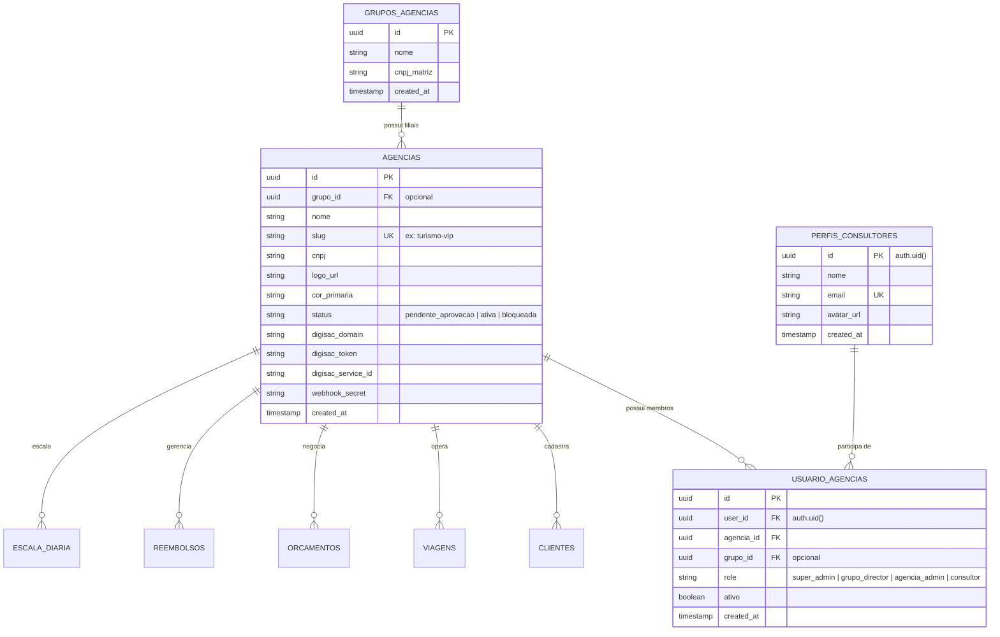
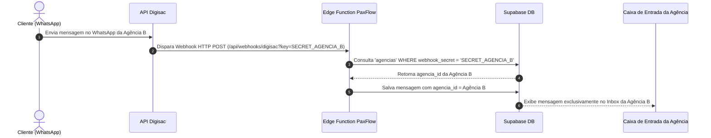
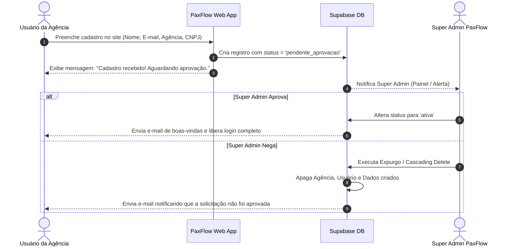

# Plano Arquitetural Completo: Escalonamento Multi-Tenant & Grupos de Agências (PaxFlow)

> [!IMPORTANT]
> **Status:** Documentação Técnica Salva para Implementação Futura.
> **Nota de Risco & Não-Regressão:** A migração para Multi-Tenant exige o cumprimento rigoroso da camada de compatibilidade legada (`DEFAULT_AGENCY_UUID` + helper `getActiveAgencyId()`) para garantir zero regressão ou interrupção na agência atualmente ativa no sistema.

---

## 1. Resumo da Solução e Viabilidade

O escalonamento do PaxFlow para atender **N agências de turismo** (sejam agências únicas/independentes ou redes/grupos empresariais) é **altamente viável** e segue as melhores práticas de arquitetura SaaS moderna baseada em **PostgreSQL / Supabase Multi-Tenant por Coluna com Row Level Security (RLS)**.

Esta abordagem permite isolamento total de dados entre empresas concorrentes, suporte a consolidação de relatórios para diretorias de redes/holdings e retenção de alta performance sem a complexidade de manter múltiplos bancos de dados.

---

## 2. Matriz Consolidada de Decisões Arquiteturais

| Pilar Arquitetural | Decisão Selecionada | Descrição Técnica |
| :--- | :--- | :--- |
| **Modelo de Organização** | **Hierárquico Dedicado** | Tabela `grupos_agencias` (Holding/Rede) e tabela `agencias` (Filiais/Lojas). Agências independentes possuem `grupo_id = NULL`. |
| **Isolamento de Dados** | **Isolamento Estrito + Leitura de Grupo** | Cada operação (`clientes`, `viagens`, `orcamentos`, `reembolsos`, `escala`) é atrelada estritamente a um `agencia_id`. O nível Grupo possui visibilidade consolidada para leitura/relatórios. |
| **Hierarquia de Papéis** | **4 Níveis de Acesso** | `super_admin` (Equipe PaxFlow) $\rightarrow$ `grupo_director` (Diretoria da Rede) $\rightarrow$ `agencia_admin` (Gerente da Loja) $\rightarrow$ `consultor` (Operacional). |
| **Vínculo Usuário-Agência** | **E-mail Único + N Agências** | Tabela `usuario_agencias` mapeia `user_id` em 1 ou mais agências. O usuário faz login 1 vez e pode alternar o contexto de agência na barra superior. |
| **Branding & Links Públicos** | **Customização por Agência com Slug** | Cada agência possui `slug`, `logo_url`, `cor_primaria` e credenciais WhatsApp Digisac. Links públicos (Itinerário VIP e NPS) carregam a marca da agência correspondente via `slug`. |
| **Segurança em Links Públicos** | **Tokens Criptográficos (UUIDv4)** | Links públicos usam `public_access_token` (32 caracteres) por viagem com verificação de agência, impedindo varredura ou adivinhação de URLs por terceiros. |
| **Integração WhatsApp Digisac** | **Webhooks com Secret por Agência** | As URLs de webhook no Digisac contêm um token/secret único da agência (`/api/webhooks/digisac?key=AGENCIA_KEY`), roteando mensagens recebidas sem ambiguidade. |
| **Armazenamento de Arquivos** | **Storage Gerenciado PaxFlow** | Todos os documentos são mantidos no Supabase Storage do PaxFlow sob a estrutura de pastas `/{grupo_id}/{agencia_id}/{cliente_id}/filename.pdf`, protegidos por RLS no Storage. |
| **Segurança no Banco** | **Supabase RLS por Colunas** | Adição de `agencia_id` e `grupo_id` em todas as tabelas operacionais com políticas RLS automáticas ativadas no banco. |
| **Onboarding & Anti-Spam** | **Auto-Cadastro com Moderação** | O auto-cadastro cria a agência com status `'pendente_aprovacao'`. O `super_admin` pode **Aprovar** (libera acesso completo) ou **Negar** (executa expurgo/purge automático apagando todos os dados criados). |
| **Limites de Plano** | **Sem Limites (Fase Beta)** | Sem bloqueios de plano ou cotas de usuários na fase inicial do rollout Multi-Tenant. |
| **Compatibilidade Legada** | **Migration em 3 Passos** | ID Padrão para agência legada + helper `getActiveAgencyId()` no código com fallback transparente para o tenant padrão caso `agencia_id` esteja ausente. |

---

## 3. Modelo de Dados Proposto (Esquema SQL/Supabase)



### Novas Tabelas a Criar

1. **`grupos_agencias`**:
   - `id` (UUID, Primary Key)
   - `nome` (Text)
   - `cnpj_matriz` (Text, Opcional)
   - `created_at` (Timestamp)

2. **`agencias`**:
   - `id` (UUID, Primary Key)
   - `grupo_id` (UUID, Foreign Key $\rightarrow$ `grupos_agencias.id`, Nullable)
   - `nome` (Text)
   - `slug` (Text, Unique, Ex: `"viagens-exemplo"`)
   - `cnpj` (Text)
   - `logo_url` (Text)
   - `cor_primaria` (Text)
   - `status` (Text: `'pendente_aprovacao'`, `'ativa'`, `'recusada'`, `'bloqueada'`)
   - `digisac_domain`, `digisac_token`, `digisac_service_id`, `webhook_secret` (Text)
   - `created_at` (Timestamp)

3. **`usuario_agencias`** (Mapeamento N-para-N entre Usuários e Agências):
   - `id` (UUID, Primary Key)
   - `user_id` (UUID, Foreign Key $\rightarrow$ `perfis_consultores.id`)
   - `agencia_id` (UUID, Foreign Key $\rightarrow$ `agencias.id`)
   - `grupo_id` (UUID, Foreign Key $\rightarrow$ `grupos_agencias.id`, Nullable)
   - `role` (Text: `'super_admin'`, `'grupo_director'`, `'agencia_admin'`, `'consultor'`)
   - `ativo` (Boolean, Default `true`)
   - `created_at` (Timestamp)

### Alterações em Tabelas Existentes

Adição da coluna `agencia_id` (UUID REFERENCES `agencias(id)`) e `grupo_id` (Nullable) em:
- `global_settings` (convertida em `agencia_settings`)
- `clientes`
- `viagens` (incluindo a coluna `public_access_token` UUID DEFAULT gen_random_uuid())
- `produtos_viagem`
- `orcamentos`
- `reembolsos`
- `escala_diaria`
- `solicitacoes_escala`
- `banco_folgas`
- `meta_periodos`
- `mensagens_diretas`

---

## 4. Políticas de Segurança (Row Level Security - RLS)

As políticas de segurança no Supabase serão configuradas para extrair o `agencia_id` e `grupo_id` diretamente das permissões do usuário autenticado via tabela `usuario_agencias`:

```sql
-- Exemplo de política de isolamento para a tabela de Viagens
CREATE POLICY "Isolamento de Viagens por Agencia e Grupo" 
ON viagens 
FOR ALL 
USING (
  -- 1. Super Admin acessa todas as viagens
  EXISTS (
    SELECT 1 FROM usuario_agencias ua 
    WHERE ua.user_id = auth.uid() AND ua.role = 'super_admin' AND ua.ativo = true
  )
  OR 
  -- 2. Diretor do Grupo acessa viagens de todas as agências do seu grupo
  EXISTS (
    SELECT 1 FROM usuario_agencias ua 
    WHERE ua.user_id = auth.uid() 
      AND ua.role = 'grupo_director' 
      AND ua.grupo_id = viagens.grupo_id 
      AND ua.ativo = true
  )
  OR 
  -- 3. Admin da Agência e Consultores acessam apenas a sua agência
  EXISTS (
    SELECT 1 FROM usuario_agencias ua 
    WHERE ua.user_id = auth.uid() 
      AND ua.agencia_id = viagens.agencia_id 
      AND ua.ativo = true
  )
);
```

---

## 5. Roteamento de Webhooks do WhatsApp Digisac



---

## 6. Workflow de Onboarding & Moderação Anti-Spam



---

## 7. Garantia de Zero Regressão para a Agência Atual

Para assegurar que a agência atual continue funcionando perfeitamente sem nenhuma interrupção ou perda de dados durante e após o deploy:

1. **Migration com Agência Default (Passo 1)**:
   - A migration de banco criará um registro fixo na tabela `agencias`: `id = '00000000-0000-0000-0000-000000000001'`, `nome = 'PaxFlow Main Agency'`, `slug = 'paxflow'`.
   - Um script SQL preencherá automaticamente todas as linhas existentes em `clientes`, `viagens`, `orcamentos`, `reembolsos`, `escala_diaria` e `perfis_consultores` com este `agencia_id` padrão.

2. **Helper `getActiveAgencyId()` no Código (Passo 2)**:
   - Toda chamada no frontend/backend passará por uma função utilitária `getActiveAgencyId()`.
   - Se por qualquer motivo a sessão do usuário não contiver um `agencia_id` definido (ou em chamadas legadas), o helper retorna automaticamente o `DEFAULT_AGENCY_UUID`.

3. **Validação em Staging (Passo 3)**:
   - O processo de migração será rodado em um ambiente de homologação (Staging) idêntico ao de produção antes do lançamento oficial.

---

## 8. Plano de Execução Futura (Quando Solicitado)

### Fase 1: Migrações de Banco & Segurança RLS
- Criar migrations SQL para as tabelas `grupos_agencias`, `agencias` e `usuario_agencias`.
- Adicionar `agencia_id` e `public_access_token` nas tabelas operacionais.
- Preencher a agência legada padrão e aplicar políticas RLS no Supabase.

### Fase 2: Serviços TypeScript & Contexto de Agência
- Atualizar `src/types/index.ts` com as novas interfaces.
- Criar o helper `getActiveAgencyId()` em `src/services/` com fallback transparente.
- Atualizar serviços de busca para incluir o escopo de `agencia_id`.

### Fase 3: Portal Super Admin & Interface Multi-Tenant
- Criar a tela de moderação `/super-admin` para Aprovar/Negar cadastros pendentes com expurgo automático.
- Implementar o seletor de agências no topo (Tenant Switcher) para usuários com perfil `grupo_director` ou multi-agência.
- Atualizar o roteamento dos itinerários públicos para usar `public_access_token`.
