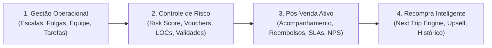
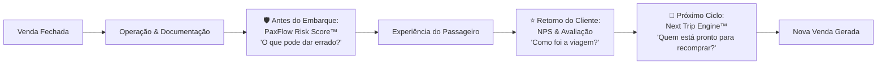
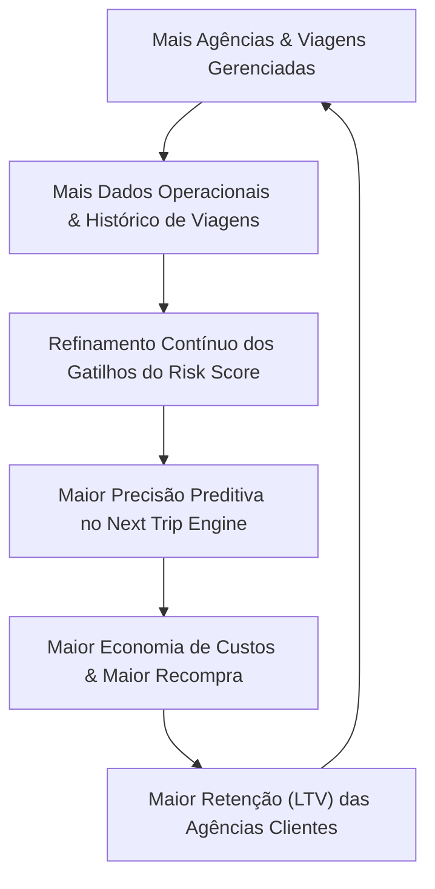
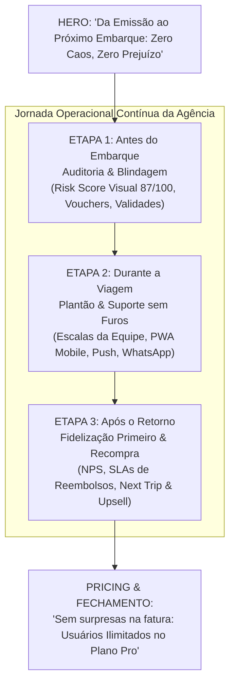

# 📊 Análise Estratégica de Produto & Posicionamento — PaxFlow

> **Resumo Executivo:** Diagnóstico detalhado sobre a evolução de posicionamento do PaxFlow, transição de categoria de mercado (de *CRM Vertical* para *Sistema Operacional do Pós-Venda & Prevenção*), mapeamento competitivo no Brasil e diretrizes para otimização da narrativa comercial sem alteração da identidade visual ou exclusão de funcionalidades.

---

## 📑 Sumário

1. [A Evolução do PaxFlow: Nova Categoria](#1-a-evolução-do-paxflow-nova-categoria)
2. [Os 4 Pilares da Nova Tese de Produto](#2-os-4-pilares-da-nova-tese-de-produto)
3. [O Diferencial Central: Máquina de Prevenção + Recompra](#3-o-diferencial-central-máquina-de-prevenção--recompra)
4. [Análise do PaxFlow Risk Score™](#4-análise-do-paxflow-risk-score)
5. [Análise do Next Trip Engine™ (Revenue Software)](#5-análise-do-next-trip-engine-revenue-software)
6. [Diagnóstico da Landing Page Atual](#6-diagnóstico-da-landing-page-atual)
7. [Hierarquia: Categoria vs. Diferenciais](#7-hierarquia-categoria-vs-diferenciais)
8. [Cenário Competitivo no Mercado Brasileiro](#8-cenário-competitivo-no-mercado-brasileiro)
9. [Matriz de Posicionamento Competitivo](#9-matriz-de-posicionamento-competitivo)
10. [Onde o PaxFlow Vence com Clareza](#10-onde-o-paxflow-vence-com-clareza)
11. [Reestruturação da Narrativa Comercial](#11-reestruturação-da-narrativa-comercial)
12. [Visualização do Produto como Principal Ativo de Conversão](#12-visualização-do-produto-como-principal-ativo-de-conversão)
13. [Papel dos Recursos Secundários: PWA, Escalas e Financeiro](#13-papel-dos-recursos-secundários-pwa-escalas-e-financeiro)
14. [Credibilidade, Naming e Precificação](#14-credibilidade-naming-e-precificação)
15. [A Verdadeira Defesa: Efeito Flywheel de Dados & IA Copiloto](#15-a-verdadeira-defesa-efeito-flywheel-de-dados--ia-copiloto)
16. [Scorecard de Avaliação da Landing Atual](#16-scorecard-de-avaliação-da-landing-atual)
17. [Alternativas de Apresentação e Vendas (Sem Mudar Identidade Visual)](#17-alternativas-de-apresentação-e-vendas)
18. [Blueprint Oficial de Apresentação e Vendas (Decisão Estratégica)](#18-blueprint-oficial-de-apresentação-e-vendas-decisão-estratégica)

---

## 1. A Evolução do PaxFlow: Nova Categoria

A mudança mais significativa ocorreu na definição do produto:

| Elemento | Antes | Agora |
| :--- | :--- | :--- |
| **Título Principal (H1)** | CRM & Pós-Venda 100% Especializado em Agências de Viagens | A Plataforma de Gestão Operacional & Pós-Venda para Agências de Viagens |
| **Subtítulo** | *Foco em CRM tradicional* | “A operação da sua agência sem caos, sem perdas e sem planilhas. Centralize controle de equipe, escalas, banco de folgas, conciliação de reembolsos aéreos, o PaxFlow Risk Score™ e recompra preditiva com o Next Trip Engine™.” |
| **Categoria Efetiva** | CRM Vertical (Commodity) | **Sistema Operacional de Gestão Operacional & Pós-Venda** |

> [!NOTE]
> Essa mudança de categoria foi um salto positivo. O PaxFlow deixou de brigar na vala comum dos "CRMs de agência" para se posicionar como o sistema central do dia a dia pós-fechamento.

---

## 2. Os 4 Pilares da Nova Tese de Produto

O produto consolidou-se em torno de 4 frentes complementares:



1. **Gestão Operacional:** Controle de equipe, escalas de trabalho, banco de compensação de folgas, distribuição de passageiros e tarefas operacionais.
2. **Controle de Risco:** Monitoramento proativo da carteira através de um índice de saúde de 0 a 100, antecipando falhas em vouchers, documentos e localizadores.
3. **Pós-Venda Ativo:** Acompanhamento do ciclo da viagem, gestão de vistos/passaportes, conciliação de reembolsos aéreos com SLA e histórico centralizado.
4. **Recompra Inteligente:** Identificação do momento ótimo para o consultor reabordar o passageiro com pacotes, upgrades, seguros e passeios baseado em histórico e satisfação.

---

## 3. O Diferencial Central: Máquina de Prevenção + Recompra

O grande valor do PaxFlow está em transformar o pós-venda em uma máquina de duas pontas: **Prevenção de Prejuízos** e **Geração de Nova Receita**.



> [!TIP]
> Essa esteira contínua (`Venda → Proteção → Experiência → NPS → Recompra`) é o coração estratégico do PaxFlow e supera qualquer discurso padrão de "temos CRM".

---

## 4. Análise do PaxFlow Risk Score™

O **PaxFlow Risk Score™** transforma a ferramenta de um mero *sistema de registro* para um **sistema de decisão operacional**.

* **O valor prático:** Permite ao gestor abrir o painel às 8h da manhã e enxergar imediatamente onde precisa agir:
  * 🔴 **3 viagens em risco crítico** (ex.: passaporte com menos de 6 meses para embarque em 15 dias)
  * 🟡 **8 viagens com pendências moderadas** (ex.: voucher de hotel ainda não anexado)
  * 🟢 **42 viagens saudáveis** (tudo checado e validado)
* **Ponto de Atenção (Credibilidade):** Evitar afirmações infladas como *"nosso algoritmo revolucionário de inteligência preditiva em tempo real"*. Se a lógica for baseada em matriz de regras operacionais de negócio, deve ser apresentada como **Motor de Auditoria & Saúde Operacional**. Isso gera confiança e autoridade junto aos donos de agência.

---

## 5. Análise do Next Trip Engine™ (Revenue Software)

Economizar tempo atrai a agência; **gerar novas vendas fideliza o dono da agência**.

* Quando o PaxFlow alerta:
  > *"A cliente Maria realizou viagem internacional há 11 meses, avaliou com NPS 10 e possui histórico de viagens anuais em outubro. Sugestão: Iniciar contato para cotação antecipada."*
* O produto deixa de ser visto apenas como uma despesa operacional e passa a ser precificado e percebido como **software de geração de receita (*Revenue Software*)**.
* **Impacto Comercial:** Permite o argumento definitivo:
  > *"O PaxFlow não serve só para sua agência não perder dinheiro com erros operacionais. Ele encontra o dinheiro que já está guardado dentro da sua própria base de passageiros."*

---

## 6. Diagnóstico da Landing Page Atual

Apesar de o produto ter evoluído substancialmente, a comunicação na página de entrada sofre com **excesso de estímulos concorrentes**.

```
[ Hero Atual ]
├── Gestão Operacional
├── Pós-Venda
├── Equipe & Escalas
├── Banco de Folgas
├── Reembolsos Aéreos
├── PaxFlow Risk Score™
├── Next Trip Engine™
├── Upsell Engine™
├── Gamificação
└── App PWA Mobile
```

> [!WARNING]
> Quando tudo é destacado com o mesmo peso no primeiro bloco da página, o visitante entra em sobrecarga cognitiva e se pergunta: *"Afinal, o que exatamente é o PaxFlow?"*.

---

## 7. Hierarquia: Categoria vs. Diferenciais

A comunicação precisa separar com rigor a **categoria principal** dos seus **diferenciais de impacto**:

1. **Definição de Categoria (Simples e Direta):**
   * *A Plataforma de Operação, Blindagem de Viagens e Pós-Venda para Agências.*
2. **Os Pilares Diferenciadores:**
   * 🛡️ **PaxFlow Risk Score™:** Previna imprevistos e prejuízos antes do embarque.
   * 🔄 **Next Trip Engine™:** Reative sua base de clientes com inteligência de recompra.
   * 👥 **Operação & Equipe:** Escalas, folgas e tarefas operacionais sob controle.
   * 💬 **Pós-Venda Especializado:** SLAs de reembolso, passaportes, vistos e itinerário digital.

---

## 8. Cenário Competitivo no Mercado Brasileiro

O PaxFlow não disputa espaço com ferramentas genéricas de CRM (Salesforce, Pipedrive, HubSpot), mas sim com os players verticais de turismo consolidados:

| Concorrente | Posicionamento Declarado | Amplitude / Foco | Modelo Comercial Notório |
| :--- | :--- | :--- | :--- |
| **PaxPro** | CRM + Financeiro + Documentos + Tarefas + Relatórios | Mais de 1.000 agências; forte tradição e presença em eventos. | A partir de R$ 299/mês (faixas por usuários). |
| **Colmeia** | Backoffice + Financeiro + CRM + Comissões + IA | Foco forte em conciliação financeira, comissões e gestão da agência. | Preço por membro/usuário. |
| **Paxy** | CRM + Orçamentos + Contratos + Marketing + NPS | Foco no funil de vendas, geração de propostas e marketing. | Planos escalonados (R$ 197 / R$ 397 / R$ 597). |
| **Operasys** | Sistema Operacional Integrado | Atendimento ao pós-venda, fornecedores e operação integral. | Modelo sob proposta comercial. |
| **ViajaFlux** | Plataforma Ampla | Vendas, financeiro, filiais, agenda, e-mail e emissões. | Modelo modular. |

---

## 9. Matriz de Posicionamento Competitivo

Para não se desgastar competindo nas mesmas mensagens genéricas ("chega de planilhas", "sistema completo", "tudo em um só lugar"), o PaxFlow deve ocupar um espaço único no mapa mental do cliente:

| Produto | Território Principal Reconhecido |
| :--- | :--- |
| **PaxPro** | Gestão Geral + Financeiro Tradicional |
| **Colmeia** | Backoffice Financeiro + Comissões + Emissões |
| **Paxy** | Propostas Comerciais + Funil de Vendas + Marketing |
| **Operasys** | Operação Cadastral Ampla |
| **PaxFlow** | **Blindagem de Viagens (Risk Score) + Pós-Venda Proativo + Recompra Preditiva** |

---

## 10. Onde o PaxFlow Vence com Clareza

O PaxFlow não precisa prometer ser o maior ERP financeiro do mercado para vencer. A agência já costuma ter seus meios contábeis. A vitória do PaxFlow está em garantir:

> **"Nenhuma viagem da sua agência dá problema no embarque. E nenhum cliente valioso é esquecido no pós-venda."**

Essa promessa resolve as duas maiores dores de cabeça do proprietário de agência:
1. **O pânico do imprevisto:** Multas, passaporte vencido, voucher não emitido no sábado à noite.
2. **O custo do cliente perdido:** Gastar fortuna para atrair novos leads enquanto quem já viajou nunca mais recebe uma mensagem no momento certo.

---

## 11. Reestruturação da Narrativa Comercial

Em vez de uma listagem enciclopédica de recursos, a narrativa recomendada para a apresentação comercial segue o ciclo natural do turismo:

```
"A sua venda terminou. A sua responsabilidade apenas começou."
```

* **Etapa 1 — Proteja a Viagem:** *PaxFlow Risk Score™* audita passaportes, vistos, prazos e vouchers antes que a falha chegue ao passageiro.
* **Etapa 2 — Organize a Operação:** Escalas, folgas, SLAs e distribuição equilibrada de passageiros entre a equipe.
* **Etapa 3 — Cuide do Pós-Venda:** Resolução ágil de reembolsos, itinerário digital, checagens de retorno e pesquisa de NPS.
* **Etapa 4 — Multiplique a Recompra:** *Next Trip Engine™* e *Upsell Engine™* indicam com precisão quem deve ser contatado hoje para a próxima viagem.

---

## 12. Visualização do Produto como Principal Ativo de Conversão

A melhor forma de vender recursos sofisticados não é com adjetivos, mas com **demonstrações visuais concretas**.

### Exemplo de Demonstração do PaxFlow Risk Score™
> Um painel com indicadores claros e ações imediatas:
> * **Saúde Operacional da Carteira:** `87/100`
> * 🟢 42 viagens protegidas e validadas
> * 🟡 8 viagens com pendências documentais leves
> * 🔴 3 viagens com risco crítico de embarque:
>   * *Passageiro João Silva — Passaporte com 4 meses de validade (Destino: Europa)*
>   * *Reserva #8841 — Voucher de hospedagem pendente (Embarque em 48h)*
>   * `[Botão: Notificar Consultor Responsável]`

### Exemplo de Demonstração do Next Trip Engine™
> A vitrine de receita recuperada:
> * **12 Oportunidades Quentes Identificadas Hoje**
> * *Ana Paula Ramos — Score 94 — Última viagem há 11 meses (NPS 10)*
> * *Carlos Eduardo — Score 88 — Histórico recorrente de viagens de neve em Julho*
> * `[Botão: Gerar Mensagem Personalizada WhatsApp]`

---

## 13. Papel dos Recursos Secundários: PWA, Escalas e Financeiro

Para manter a clareza e evitar dispersão do produto, as funcionalidades existentes devem ser enquadradas nos papéis corretos:

* **App PWA Mobile:** Não vender "a tecnologia PWA". Vender o benefício: *"Alertas operacionais urgentes no bolso do gestor e do consultor, mesmo fora do escritório."*
* **Escalas & Banco de Folgas:** Apresentar como facilitador operacional interno para equipes de plantão de agência, evitando que o produto pareça um "sistema genérico de RH".
* **Módulo Financeiro:** Focar fortemente no que impacta o cliente e a operação (ex.: **conciliação e SLA de reembolsos aéreos**), evitando disputar espaço com ERPs pesados de contabilidade.

---

## 14. Credibilidade, Naming e Precificação

### Refinamento de Linguagem
* **Substituir:** Termos como *"revolucionário"*, *"IA mágica"*, *"algoritmo sem precedentes"*.
* **Adotar:** Linguagem executiva de auditoria e inteligência: *"Motor de regras operacionais"*, *"Diagnóstico de conformidade"*, *"Pontuação preditiva de recompra"*.

### Política de Preços Atual
* **Plano Solo:** R$ 199/mês
* **Plano Agência Pro:** R$ 799/mês (Usuários Ilimitados, Risk Score, Next Trip, Escalas, WhatsApp)
* **Plano Enterprise:** Sob consulta

> [!NOTE]
> R$ 799/mês para usuários ilimitados é uma proposta competitiva e sustentável quando comparada ao modelo de cobrança por usuário de ferramentas concorrentes, desde que o valor gerado (evitar perdas operacionais + gerar novas vendas) esteja nítido na apresentação.

---

## 15. A Verdadeira Defesa: Efeito Flywheel de Dados & IA Copiloto

A barreira competitiva de longo prazo do PaxFlow reside na inteligência acumulada sobre o comportamento do viajante e sobre as falhas operacionais recorrentes.



### O Papel da Inteligência Artificial: Copiloto Operacional
Em vez de um assistente de texto vago, a IA do PaxFlow atua como resposta a perguntas práticas do dia a dia:
* *"Por que o índice de risco da agência subiu hoje?"* → *"Porque 4 passageiros do grupo de Paris estão sem visto confirmado faltando 20 dias para a viagem."*
* *"Quem são os 5 clientes mais propensos a comprar cruzeiros para o fim de ano?"* → Resposta baseada no histórico de reservas e pontuações do motor de recompra.

---

## 16. Scorecard de Avaliação da Landing Atual

| Critério | Nota (0 a 10) | Diagnóstico |
| :--- | :---: | :--- |
| **Posicionamento** | **8.5** | Evolução notável em relação a ser apenas mais um CRM; categoria bem direcionada. |
| **Clareza de Proposta** | **7.0** | Quantidade excessiva de recursos concorrendo pela atenção no hero da página. |
| **Potencial de Diferenciação** | **9.0** | O conjunto *Risk Score + Next Trip* é único no mercado brasileiro de agências. |
| **Prova e Demonstração** | **6.5** | A página ainda descreve muito em texto e mostra pouco os painéis em ação prática. |
| **Qualidade da Copy** | **7.5** | Tom moderno e persuasivo, porém com excesso de termos superlativos que podem ser enxugados. |
| **Aderência ao Mercado** | **9.0** | Mercado brasileiro é amplo, fragmentado e carente de automação pós-venda. |
| **Conversão Geral da Página** | **7.5** | O produto entrega muito mais valor real do que a landing page consegue transmitir hoje. |

---

## 17. Alternativas de Apresentação e Vendas (Sem Mudar Identidade Visual)

Para elevar a conversão sem remover qualquer funcionalidade existente e sem alterar a paleta/identidade visual estabelecida, foram desenhadas três alternativas de estruturação:

### Alternativa 1: Narrativa Cronológica da Jornada da Agência *(Recomendada)*
* **Conceito:** Organizar a apresentação da landing page e do pitch comercial exatamente na ordem cronológica que o dono da agência vivencia todos os dias:
  1. **Antes da Viagem (Blindagem):** PaxFlow Risk Score™, validação documental, vouchers e passaportes.
  2. **Durante a Viagem (Operação Viva):** Gestão da equipe de plantão, escalas, itinerário do passageiro e WhatsApp.
  3. **Após a Viagem (Pós-Venda & Recompra):** Conciliação de reembolsos aéreos, pesquisa de NPS, Next Trip Engine™ e Upsell Engine™.
* **Vantagem:** Nenhuma funcionalidade é omitida, mas a cabeça do visitante entende a ferramenta como uma solução completa e lógica de ponta a ponta.

### Alternativa 2: Duplo Motor — "Escudo Operacional & Motor de Receita"
* **Conceito:** Apoiar a apresentação em dois grandes blocos de alto impacto financeiro:
  * **O Escudo:** "Evite prejuízos e multas operacionais com o PaxFlow Risk Score™ e SLAs de reembolsos."
  * **O Motor:** "Aumente as vendas da sua própria carteira com o Next Trip Engine™ e Upsell automatizado."
* **Recursos operacionais:** Escalas, folgas e relatórios aparecem como a infraestrutura de apoio abaixo dos dois motores.
* **Vantagem:** Muito atraente para o dono/sócio da agência, pois conecta o software diretamente à preservação de margem e crescimento de faturamento.

### Alternativa 3: Painel Interativo de Simulação no Topo da Página
* **Conceito:** Manter a estrutura textual atual, mas substituir a descrição estática do hero por um mockup dinâmico/interativo onde o visitante pode alternar entre:
  * `[Ver Diagnóstico de Risco em Tempo Real (87/100)]`
  * `[Ver Radar de Recompra (12 Oportunidades Hoje)]`
* **Vantagem:** Mostra o software funcionando logo nos primeiros 5 segundos de visita, provando a sofisticação sem exigir leitura de parágrafos longos.

---

## 18. Blueprint Oficial de Apresentação e Vendas (Decisão Estratégica)

> **Diretriz Aprovada:** Adoção da **Alternativa 1 (Narrativa em Linha do Tempo)** para a apresentação comercial e landing page do PaxFlow, sem remover qualquer funcionalidade do sistema e preservando integralmente a identidade visual da marca (paleta dark mode, azuis profundos, gradientes esmeralda/ciano/âmbar e elementos de bússola).



### 18.1. Topo & Hero Headline
* **Headline Principal (H1):**
  > *"Da Emissão ao Próximo Embarque: Zero Caos, Zero Prejuízo"*
* **Subtítulo:**
  > *"A plataforma que audita documentos, organiza a equipe em plantões e encontra clientes prontos para recomprar na sua carteira."*
* **Chamadas para Ação (CTAs):**
  * Botão Primário: `[Iniciar Demonstração Guiada]`
  * Botão Secundário: `[Acessar o PaxFlow]`
* **Badges de Confiança:**
  * `🛡️ Risk Score Integrado` • `👥 Usuários Ilimitados no Pro` • `📱 App PWA no Celular` • `⚡ Setup em Minutos`

---

### 18.2. Etapa 1 — Antes do Embarque (Auditoria & Blindagem)
* **Conceito Central:** Demonstrar o poder de prevenção do PaxFlow antes de explicar teorias técnicas.
* **Componente Visual de Destaque:**
  * Painel simulado do **PaxFlow Risk Score™ (87/100)**:
    * 🟢 **42 viagens protegidas e validadas** (tudo conferido para o embarque)
    * 🟡 **8 viagens com pendências leves** (ex.: seguro viagem a confirmar)
    * 🔴 **3 alertas críticos com ação em 1 clique:**
      * *Passaporte com validade inferior a 6 meses para destino internacional*
      * *Voucher de hospedagem pendente a 48h do check-in*
      * *Localizador aéreo (LOC) não conciliado*
* **Mensagem:** *"Descubra em segundos o que pode dar errado antes que o passageiro chegue ao aeroporto."*

---

### 18.3. Etapa 2 — Durante a Viagem (Plantão & Suporte sem Furos)
* **Conceito Central:** Enquadrar escalas e folgas não como burocracia de RH, mas como garantia de atendimento impecável ao viajante em trânsito.
* **Recursos Organizados nesta Etapa:**
  * **Escalas & Plantões:** Escala visual de trabalho, cobertura de finais de semana e banco de folgas equilibrado.
  * **App PWA Mobile com Push:** Alertas urgentes no celular do consultor ou gestor de plantão.
  * **Atendimento Ágil:** Integração com WhatsApp / Digisac e itinerário digital na mão do cliente.
* **Mensagem:** *"Sua agência nunca fica descoberta. Escalas inteligentes e alertas no celular para resolver qualquer imprevisto em tempo real."*

---

### 18.4. Etapa 3 — Após o Retorno (Fidelização Primeiro & Recompra)
* **Conceito Central:** A recompra é consequência de um passageiro bem cuidado no pós-venda.
* **Sequência Lógica de Apresentação:**
  1. **Resolução de Atritos:** Gestão e conciliação de **reembolsos aéreos com cronômetro de SLA** (evita desgaste e perda de prazo).
  2. **Pesquisa de Satisfação:** Coleta automática de **NPS e avaliações de viagem**.
  3. **Ativação da Recompra:** Com o NPS positivo e o histórico de periodicidade do viajante, entra em ação o **Next Trip Engine™** e o **Upsell Engine™**:
     * *"12 passageiros identificados com alto potencial de compra este mês"*.
     * Sugestões personalizadas de destinos, upgrades e seguros com base em dados reais.
* **Mensagem:** *"Feche o ciclo com excelência: resolva reembolsos no prazo, encante com NPS alto e receba na tela quais clientes estão prontos para comprar de novo."*

---

### 18.5. Estrutura Comercial & Cards de Preço
* **Mensagem de Destaque no Plano Pro (R$ 799/mês):**
  > **"Sem surpresas na fatura: convide toda a sua equipe (plantonistas, emissores e consultores) com usuários ilimitados no Plano Pro."**
* **Diferenciação Competitiva:** Enfatizar a liberdade de colocar a equipe inteira na ferramenta sem a penalidade de pagar por cada atendente adicional, ao contrário de sistemas tradicionais do mercado.
* **Transparência de Escopo:** Todos os recursos (Risk Score, Next Trip, Escalas, PWA, Conciliação de Reembolsos) inclusos de forma transparente.