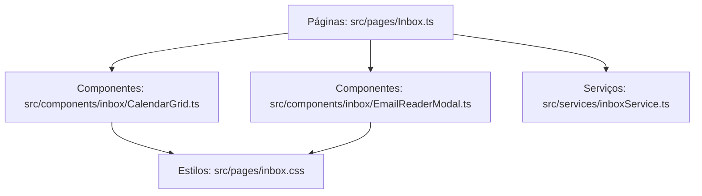

# Plano de Refatoração Modular — Mitigação de "God Files" no PaxFlow

Este plano descreve o diagnóstico, as decisões de design e o cronograma de refatoração para modularizar as páginas e componentes do PaxFlow, reduzindo arquivos monolíticos (de 1000 a 2600+ linhas) para arquivos menores e focados em responsabilidades únicas.

---

## O Diagnóstico: Por que os arquivos são gigantes?

Cada página do PaxFlow é representada por uma única classe (ex: `InboxPage` em `Inbox.ts`) que centraliza:
1.  **Estilos CSS:** Centenas de linhas de estilos injetados via blocos `<style>` em strings no cabeçalho do documento.
2.  **Operações de Banco de Dados:** Consultas diretas ao Supabase (`insert`, `select`, `update`, `delete`) misturadas com controle visual.
3.  **HTML em Template Literals:** Markup complexo e extenso embutido em métodos JS/TS.
4.  **Manipulação de Eventos:** Anexação de múltiplos ouvintes (`addEventListener`) para formulários e modais no mesmo arquivo.

---

## A Solução: Arquitetura Modular em Vanilla TypeScript

Podemos organizar o código em camadas limpas sem precisar adicionar um framework (como React ou Vue), usando recursos nativos do TypeScript e do Vite:

1.  **CSS Modular (Styles):** Mover todos os blocos de estilos em string para arquivos `.css` individuais e importá-los diretamente (ex. `import './inbox.css';`). O Vite resolve a compilação e injeção automaticamente.
2.  **Camada de Serviços (Services):** Criar arquivos em `src/services/` (ex. `inboxService.ts`, `orcamentosService.ts`) contendo funções assíncronas puras para consultas do Supabase. As páginas apenas chamam esses métodos e renderizam a resposta.
3.  **Camada de Componentes (Components):** Subdividir modais e blocos de visualização complexos (ex: leitor de e-mails, grade de calendário) em classes ou funções construtoras em `src/components/`.

---

## Cronograma de Execução em Fases (Baixo Consumo de Tokens)

Para respeitar os limites de contexto e manter o consumo de tokens sob controle, o plano de refatoração foi modularizado em fases independentes:

### [x] Fase 1: Extração de Estilos (CSS Externo)
*   **O que fazer:** Mover as centenas de linhas de CSS estático embutido em `main.ts`, `Inbox.ts`, `Orcamentos.ts` e `Clientes.ts` para arquivos `.css` externos na mesma pasta dos respectivos componentes.
*   **Consumo de Tokens:** **BAIXÍSSIMO**
*   **Risco de Regressão:** Nulo.

### [x] Fase 2: Service Layer do Inbox
*   **O que fazer:** Criar `src/services/inboxService.ts` e extrair todas as consultas complexas do Supabase (compilação de alertas, lembretes manuais, SLAs e notificações de menção) contidas em `Inbox.ts`.
*   **Consumo de Tokens:** **BAIXO**
*   **Risco de Regressão:** Baixo.

### [x] Fase 3: Service Layer de Orçamentos
*   **O que fazer:** Criar `src/services/orcamentosService.ts` e extrair todas as chamadas do banco de dados (pesquisa de leads, mudança de status de funil, reatribuição de consultor) contidas em `Orcamentos.ts`.
*   **Consumo de Tokens:** **BAIXO**
*   **Risco de Regressão:** Baixo.

### [x] Fase 4: Modularização de Modais e Componentes de Tela
*   **O que fazer:** Extrair modais gigantes como `EmailReaderModal.ts` (de `Inbox.ts`) e `VerNotasModal.ts` (de `Orcamentos.ts`) para arquivos independentes em `src/components/`.
*   **Consumo de Tokens:** **MÉDIO**
*   **Risco de Regressão:** Médio.

### [x] Fase 5: App Shell & Login Roteador
*   **O que fazer:** Limpar `main.ts` extraindo a página/fluxo de login e o modal de edição de perfil "Meu Perfil" para arquivos dedicados.
*   **Consumo de Tokens:** **MÉDIO**
*   **Risco de Regressão:** Médio.

---

## Como retomar o planejamento em futuras conversas
Sempre que iniciar uma nova conversa com o Antigravity para continuar a refatoração:
1.  Peça ao agente para ler este arquivo: `view_file` em `/home/curupaco/Projetos/PaxFlow/docs/refactoring_plan.md`.
2.  Indique qual **Fase** você deseja executar.
3.  O agente iniciará a criação do plano específico (`implementation_plan.md`) para aquela fase, mantendo o consumo de tokens controlado.
