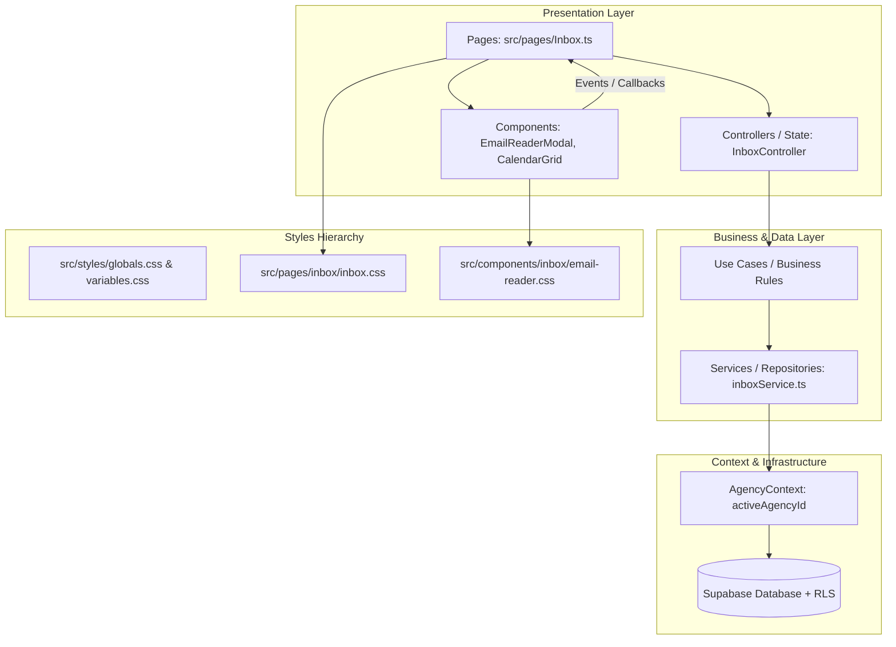

# Plano de Refatoração Modular v2.0 — Mitigação de "God Files" no PaxFlow

Este documento especifica o diagnóstico arquitetural, os princípios de design, a estrutura de camadas em Vanilla TypeScript e o cronograma de execução em fases para desmembrar arquivos monolíticos ("God Files" de 1000 a 2600+ linhas) no PaxFlow.

---

## 1. Objetivo & Visão Geral

Reduzir o acoplamento entre apresentação gráfica, estado reativo, regras de negócio e infraestrutura de banco de dados. O objetivo é transformar páginas monolíticas em módulos coesos e focados em responsabilidades únicas, **sem introduzir frameworks adicionais** (mantendo Vanilla TypeScript + Vite) e **preparando a base de código diretamente para a arquitetura Multi-Tenant** ([`MultiTenant_Plano.md`](file:///home/curupaco/Projetos/PaxFlow/docs/MultiTenant_Plano.md)).

---

## 2. Diagnóstico Arquitetural: Por que os arquivos são gigantes?

A análise das páginas monolíticas do PaxFlow (ex: `Inbox.ts`, `Orcamentos.ts`, `Clientes.ts`, `main.ts`) identificou quatro sintomas superficiais e duas causas-raiz arquiteturais:

### Sintomas Superficiais
1. **Estilos CSS Embutidos:** Centenas de linhas de CSS estático injetadas em blocos `<style>` contidos em template literals JS/TS.
2. **Consultas diretas ao Banco:** Operações diretas ao Supabase (`insert`, `select`, `update`, `delete`) executadas dentro de métodos visuais.
3. **HTML e Templating Acoplados:** Markup extenso e dinâmico concatenado dentro de métodos de renderização da classe da página.
4. **Listeners Descentralizados:** Múltiplas chamadas `addEventListener` anexadas diretamente ao DOM sem controle de ciclo de vida ou delegação.

### Causas-Raiz Arquiteturais
1. **Estado da Tela Centralizado na Renderização:** A classe da página (ex: `InboxPage`) é dona de todo o estado reativo da aplicação: dados carregados, filtros ativos, item selecionado, modais abertos, usuário atual, loading, paginação, calendário e SLAs.
2. **Acoplamento Triplo (UI + Negócio + Infraestrutura):** Regras de negócio (ex: cálculo de SLA ou elegibilidade de reembolso), chamadas Supabase e atualizações visuais do DOM vivem dentro dos mesmos handlers de eventos.

---

## 3. Diretrizes e Princípios Arquiteturais Invioláveis

1. **Isolamento de Infraestrutura em Páginas:** Nenhum arquivo em `src/pages/` deve importar o cliente Supabase diretamente (`import { supabase } from ...`). A comunicação com o banco ocorre estritamente via camada de Serviços.
2. **Isolamento de Infraestrutura em Componentes:** Componentes de UI em `src/components/` não executam consultas nem comandos diretos ao banco. Eles recebem dados por propriedades/inputs e comunicam ações por callbacks/outputs.
3. **Serviços Isentos de DOM:** Arquivos em `src/services/` realizam operações de dados sem qualquer dependência ou manipulação direta de elementos do DOM (HTML / document / window).
4. **Alinhamento Multi-Tenant Nativo (`AgencyContext`):** Toda a camada de serviços nasce preparada para operar sob o contexto de agência (`agencia_id` / `AgencyContext`). Não serão criadas funções de serviço genéricas que precisem ser refatoradas no rollout do multi-tenant.
5. **Gerenciamento Estrito de Ciclo de Vida (DOM Lifecycle):** Componentes interativos devem implementar métodos explícitos de inicialização (`mount()`) e limpeza (`unmount()`), ou utilizar delegação de eventos para evitar vazamento de memória e duplicação de `addEventListener`.
6. **Contratos Estritos via TypeScript:** Proibido o uso de `any` nas entradas e saídas dos Serviços e Componentes. Todos os tipos e DTOs devem ser definidos em `src/types/`.
7. **Desacoplamento do Tratamento de Erros:** A camada de serviço captura erros técnicos e os retorna como resultado tipado ou exceção de domínio. A camada de apresentação (Página/Controller) decide como notificar o usuário (alert, toast, modal).

---

## 4. Arquitetura Modular em Vanilla TypeScript

A solução adota uma arquitetura em camadas utilizando TypeScript nativo e compilação do Vite:


```mermaid
graph TD
    subgraph Presentation Layer
        P[Pages: src/pages/Inbox.ts] --> C[Components: EmailReaderModal, CalendarGrid]
        P --> Ctrl[Controllers / State: InboxController]
    end

    subgraph Business & Data Layer
        Ctrl --> UC[Use Cases / Business Rules]
        UC --> S[Services / Repositories: inboxService.ts]
        C -->|Events / Callbacks| P
    end

    subgraph Context & Infrastructure
        S --> AC[AgencyContext: activeAgencyId]
        AC --> DB[(Supabase Database + RLS)]
    end

    subgraph Styles Hierarchy
        G[src/styles/globals.css & variables.css]
        P --> PC[src/pages/inbox/inbox.css]
        C --> CC[src/components/inbox/email-reader.css]
    end
```

---

## 5. Estrutura de Diretórios Recomendada

```
src/
├── styles/
│   ├── globals.css          # Reset e regras globais
│   ├── variables.css        # Cores, fontes e espaçamentos
│   └── utilities.css        # Classes utilitárias compartilhadas
├── core/
│   ├── context/
│   │   └── AgencyContext.ts # Contexto reativo de agência (Multi-Tenant)
│   └── router.ts            # Navegação e resolução de rotas
├── types/
│   ├── inbox.ts             # Tipos de dados e DTOs da caixa de entrada
│   ├── orcamentos.ts        # Tipos para orçamentos e leads
│   └── common.ts            # Tipos transversais (Result, Error, Pagination)
├── services/
│   ├── inbox/
│   │   ├── inboxQueries.ts  # Consultas de leitura (Leitura)
│   │   └── inboxCommands.ts # Operações de alteração (Escrita)
│   ├── inboxService.ts      # Fachada consolidada do Inbox
│   ├── orcamentosService.ts # Serviços de orçamentos e funil
│   └── clientesService.ts   # Serviços de gestão de clientes
├── components/
│   └── inbox/
│       ├── EmailReaderModal.ts
│       ├── email-reader.css
│       ├── CalendarGrid.ts
│       └── calendar-grid.css
├── pages/
│   └── inbox/
│       ├── Inbox.ts         # Orquestrador visual da página
│       └── inbox.css        # Estilos específicos da página Inbox
└── utils/
    └── formatters.ts        # Formatadores puros de data/moeda
```

---

## 6. Cronograma de Execução em Fases

Para garantir baixo consumo de tokens e estabilidade no ambiente de desenvolvimento, cada fase deve ser executada de forma independente, finalizando em um estado compilável e com teste de regressão.

### Fase 0: Baseline & Mapeamento de Dependências
* **Objetivo:** Catalogar a estrutura existente antes de realizar qualquer alteração de código.
* **Escopo:** Mapear tamanho dos arquivos, lista de imports, chamadas diretas ao Supabase, listeners registrados e dependências circulares.
* **Risco de Regressão:** Nulo.
* **Definition of Done (DoD):**
  - [ ] Inventário de arquivos monolíticos documentado.
  - [ ] Mapeamento das queries Supabase ativas em cada página.

### Fase 1: Extração de Estilos (CSS Modular por Responsabilidade)
* **Objetivo:** Mover os blocos de CSS estático embutido em string para arquivos `.css` dedicados, organizados na hierarquia `styles/`, `pages/` e `components/`.
* **Escopo:** `main.ts`, `Inbox.ts`, `Orcamentos.ts`, `Clientes.ts`.
* **Risco de Regressão:** Baixo (preservar especificidade e ordem de carregamento sem refatorar seletores).
* **Definition of Done (DoD):**
  - [ ] Zero blocos `<style>` em template literals nas páginas.
  - [ ] Arquivos `.css` criados e importados via ES Modules (`import './inbox.css'`).
  - [ ] Layout visual e responsividade mantidos idênticos ao original.

### Fase 2: Service Layer do Inbox & Alinhamento com AgencyContext
* **Objetivo:** Criar `src/services/inboxService.ts` e isolar consultas de alertas, lembretes manuais, SLAs e menções.
* **Escopo:** Separar a camada em Queries (leitura) e Commands (escrita), integrando a passagem de `agencia_id`.
* **Risco de Regressão:** Baixo.
* **Definition of Done (DoD):**
  - [ ] `Inbox.ts` não possui nenhum import de `@supabase/supabase-js`.
  - [ ] Todas as chamadas de banco do Inbox utilizam `inboxService.ts`.
  - [ ] Tipos explicitamente declarados em `src/types/inbox.ts`.
  - [ ] Integração com `AgencyContext` preservada.

### Fase 3: Service Layer de Orçamentos e Clientes
* **Objetivo:** Criar `orcamentosService.ts` e `clientesService.ts` para isolar buscas de leads, mudanças de status e atribuição de consultores.
* **Escopo:** Refatoração de `Orcamentos.ts` e `Clientes.ts`.
* **Risco de Regressão:** Baixo.
* **Definition of Done (DoD):**
  - [ ] `Orcamentos.ts` e `Clientes.ts` desvinculados do cliente Supabase.
  - [ ] Tratamento de exceções e erros de rede padronizados.

### Fase 4: Componentização Funcional & Lifecycle de Modais
* **Objetivo:** Extrair modais e blocos visuais extensos (`EmailReaderModal.ts`, `VerNotasModal.ts`, `CalendarGrid.ts`) para `src/components/`.
* **Escopo:** Implementar contratos claros de entrada (Props), saída (Events) e ciclo de vida (`mount()` / `unmount()`).
* **Risco de Regressão:** Médio.
* **Definition of Done (DoD):**
  - [ ] Modais extraídos em módulos isolados em `src/components/`.
  - [ ] Componentes sem acessos diretos ao Supabase.
  - [ ] Event listeners desanexados no encerramento (`unmount`).

### Fase 5: Application Shell & Bootstrapping
* **Objetivo:** Reduzir `main.ts` a um ponto de entrada (bootstrap) enxuto e estruturado.
* **Escopo:** Separar o roteamento (`router.ts`), fluxo de autenticação (`auth/`) e o modal global "Meu Perfil".
* **Risco de Regressão:** Médio.
* **Definition of Done (DoD):**
  - [ ] `main.ts` reduzido para < 100 linhas com responsabilidade exclusiva de bootstrapping.
  - [ ] Fluxo de autenticação isolado em módulo próprio.

### Fase 6: Camada de Estado & Controllers (Por Domínio)
* **Objetivo:** Separar as regras de interação e estado reativo da rendering engine da página.
* **Escopo:** Introduzir controllers leves (ex: `InboxController.ts`) para controlar filtros, ordenação e itens selecionados.
* **Risco de Regressão:** Médio.
* **Definition of Done (DoD):**
  - [ ] Separação clara entre orquestração de DOM (`InboxPage`) e gerenciamento de estado (`InboxController`).

### Fase 7: Padronização Transversal & Limpeza Estrutural
* **Objetivo:** Padronizar estados visuais de feedback (`loading`, `empty`, `error`) e eliminar código legado.
* **Risco de Regressão:** Baixo.
* **Definition of Done (DoD):**
  - [ ] Padrão de componentes feedback reutilizável em todas as páginas refatoradas.
  - [ ] Código morto e temporário removido.

### Fase 8: Validação Arquitetural & Anti-Regressão
* **Objetivo:** Garantir a sustentabilidade da arquitetura e evitar o surgimento de novos "God Files".
* **Definition of Done (DoD):**
  - [ ] Verificação: Nenhuma página em `src/pages/` importa diretamente o Supabase.
  - [ ] Nenhuma classe/arquivo ultrapassa os limites recomendados de responsabilidade.
  - [ ] Ausência de dependências circulares entre componentes e serviços.

---

## 7. Workflow de Execução das Fases

Para executar qualquer uma das fases acima com o assistente Antigravity:
1. Informe a **Fase** pretendida (ex: *"Executar a Fase 2 do refactoring_plan.md"*).
2. O assistente iniciará pelo mapeamento da fase, efetuará as alterações com compilação e validação estática do TypeScript, concluindo com a validação visual/funcional.
